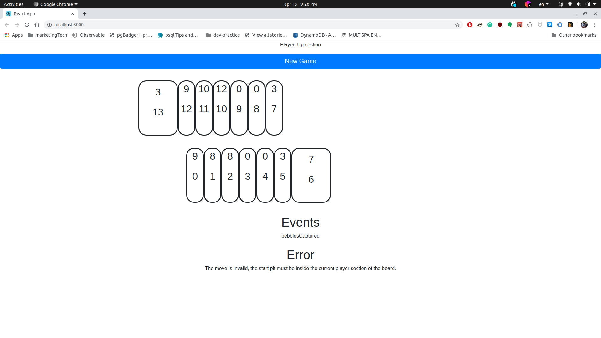

# Mancala Front End

This is a very basic front end that can be used to test https://github.com/douglaszuniga/mancala

# Instruction

## Build and Run

This is a React web app, built using create https://create-react-app.dev/

In order to run this run the following command:

```
npm start
```

## Play

In order to play make sure that the backend is running in port `8080`, then click on `new game` button.

At the very top a label will indicate who and what section the player can click.

In the middle you will find the gameboard, there are 14 elements, the smallers are the pits and the big ones are the mancalas.

Each element has two number, the one on top is the number of pebbles the other is the position of the element in the board

## Sample UI


